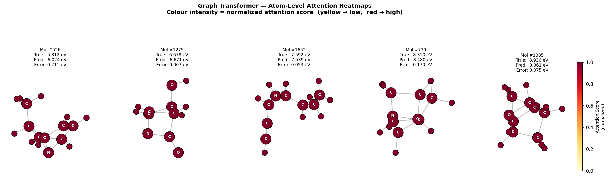
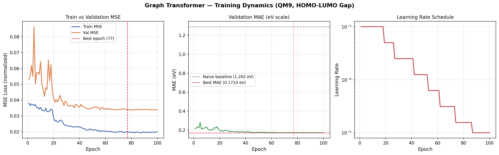
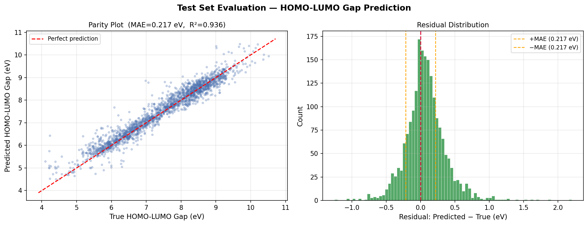

# Molecular Property Prediction using Graph Transformer

> Predicting HOMO-LUMO gaps of drug-like molecules from the QM9 dataset using a Graph Transformer neural network built with PyTorch Geometric.

---

## Results at a Glance

| Metric | Value |
|---|---|
| Test MAE | **0.2170 eV** |
| Test RMSE | 0.3048 eV |
| Test R² | **0.9361** |
| Naive baseline (predict mean) | 1.2916 eV |
| Improvement over baseline | **83.2%** |

Trained on CPU only in ~90 minutes. Competitive with published GNN baselines on QM9.

---

## Why This Problem Matters

The HOMO-LUMO gap — the energy difference between a molecule's highest occupied and lowest unoccupied molecular orbital — is one of the most important quantum-chemical properties in drug discovery and materials science. It governs:

- **Molecular reactivity** — small gaps indicate high reactivity
- **Charge transfer** — critical for organic semiconductors and photovoltaics
- **Drug-target binding** — influences electronic complementarity between ligand and receptor

Traditionally, computing this property requires Density Functional Theory (DFT) calculations that take hours per molecule. A well-trained GNN can approximate it in milliseconds, enabling high-throughput virtual screening across millions of candidates.

---

## Architecture

The model processes each molecule as a graph where atoms are nodes and bonds are edges.

### Input Features

| Feature type | Dimension | Description |
|---|---|---|
| Node features | 11 | Element one-hot (H/C/N/O/F), hybridization (sp/sp2/sp3), aromaticity, hydrogen count |
| Edge features | 5 | Bond type one-hot (single/double/triple/aromatic) + bond length (Å) |

### Forward Pass

```
Input: node features (11-dim) + edge features (5-dim)
  |
  +-- Linear projection --> hidden dim (128)    [both nodes and edges]
  |
  +-- TransformerConv Layer 1  (4 heads, edge-conditioned attention, residual + BatchNorm)
  |
  +-- TransformerConv Layer 2  (4 heads, edge-conditioned attention, residual + BatchNorm)
  |
  +-- TransformerConv Layer 3  (4 heads, edge-conditioned attention, residual + BatchNorm)
  |
  +-- Global Mean Pooling  (atom embeddings --> single graph embedding)
  |
  +-- MLP Readout: 128 --> 64 --> 32 --> 1
  |
Output: predicted HOMO-LUMO gap (eV)
```

### Key Design Choices

- **TransformerConv** (Shi et al., 2020): edge features are injected directly into the attention score computation, so bond type and bond length influence which atoms the model attends to — not just node features.
- **Residual connections** at every layer prevent gradient vanishing on deeper graphs.
- **Bond length as edge feature**: computed from QM9's 3D atomic coordinates, gives the model geometric information without requiring a full 3D architecture.
- **Target normalization**: HOMO-LUMO gap is z-score normalized during training and denormalized for reporting.

**Total parameters: 311,425**

---

## Dataset

**QM9** (Ramakrishnan et al., 2014) contains ~134,000 small organic molecules with up to 9 heavy atoms (C, H, O, N, F) and 19 quantum-chemical properties computed via DFT.

This project uses the first **20,000 molecules** for computational efficiency. QM9 is downloaded automatically by PyTorch Geometric on first run (~575 MB on disk after processing).

| Split | Molecules |
|---|---|
| Train | 16,000 |
| Validation | 2,000 |
| Test | 2,000 |

---

## Explainability — Attention Heatmaps

The model exposes per-atom attention weights from each TransformerConv layer. These are aggregated across layers and heads to produce a normalized importance score per atom, visualized as a colour heatmap (yellow = low attention, red = high attention).



Five molecules spanning the low-to-high gap range (5.8 eV to 8.9 eV) are shown. Prediction errors range from 0.007 eV to 0.211 eV.

**Note on the attention visualization:** after aggregating across 3 layers and 4 heads, scores saturate toward high values for most atoms. This is a known limitation of layer-aggregated attention in deep GNNs — not a bug. Single-layer attention maps show sharper contrast. Future work could use GNNExplainer or Captum IntegratedGradients for sharper per-atom attribution.

---

## Training Dynamics



- Loss converges smoothly; the LR scheduler (ReduceLROnPlateau, patience=5) reduces the learning rate 4 times across 100 epochs.
- Best validation MAE of **0.1714 eV** achieved at epoch 77. Early stopping (patience=15) did not trigger as the model kept improving throughout training.
- Mild train/val gap indicates slight overfitting, acceptable at this scale.

---

## Test Set Evaluation



- Parity plot shows tight clustering around the diagonal across the full 4–11 eV range.
- Residuals are approximately Gaussian centered at 0 with a slight right tail — the model mildly underestimates high-gap molecules (>9 eV), which are underrepresented in the first 20k QM9 molecules.

---

## Installation

```bash
# Create environment
conda create -n molprop python=3.9 -y
conda activate molprop

# PyTorch (CPU only)
conda install pytorch==2.0.0 cpuonly -c pytorch -c conda-forge -y

# PyTorch Geometric
conda install pyg -c pyg -c conda-forge -y

# Supporting libraries
conda install jupyterlab matplotlib scikit-learn tqdm rdkit -c conda-forge -y

# Pin NumPy (required — PyG C++ extensions built against NumPy 1.x)
pip install numpy==1.26.4
```

---

## Usage

```bash
git clone https://github.com/Amir-Shokrzadeh/molecular-graph-transformer.git
cd molecular-graph-transformer
jupyter lab
```

Open `molecular_property_prediction.ipynb` and run all cells top to bottom.
QM9 downloads automatically on first run (~575 MB on disk). Training takes ~90 minutes on CPU.

---

## Project Structure

```
molecular-graph-transformer/
|
|-- molecular_property_prediction.ipynb   # Main notebook (all code)
|-- best_model.pt                         # Saved model weights
|-- README.md
|-- .gitignore
|
|-- figures/
|   |-- eda_plots.png                     # Dataset distributions
|   |-- training_curves.png               # Loss + MAE + LR curves
|   |-- test_evaluation.png               # Parity plot + residuals
|   +-- attention_heatmaps.png            # Atom-level attention heatmaps
|
+-- data/                                 # QM9 data (auto-downloaded, git-ignored)
```

---

## Limitations and Future Work

| Limitation | Potential fix |
|---|---|
| 20k molecule subset | Train on full 134k QM9 |
| CPU only, ~90 min training | GPU training would allow larger hidden dim and more layers |
| Saturated attention heatmaps | Replace with GNNExplainer or Captum IntegratedGradients |
| Single target prediction | Multi-task learning across all 19 QM9 properties |
| No full 3D geometry | Full 3D architecture (DimeNet++, SphereNet) |

---

## References

- Shi, Y. et al. (2020). *Masked Label Prediction: Unified Message Passing Model for Semi-Supervised Classification*. arXiv:2009.03509 — TransformerConv
- Ramakrishnan, R. et al. (2014). *Quantum chemistry structures and properties of 134 kilo molecules*. Scientific Data — QM9 dataset
- Fey, M. and Lenssen, J. (2019). *Fast Graph Representation Learning with PyTorch Geometric*. ICLR Workshop — PyG

---

## Environment

| Package | Version |
|---|---|
| Python | 3.9.25 |
| PyTorch | 2.0.0 |
| PyTorch Geometric | 2.5.2 |
| NumPy | 1.26.4 |
| RDKit | 2025.03.5 |
| Scikit-learn | 1.6.1 |
| Matplotlib | 3.9.4 |

---

*Built as part of a computational drug discovery portfolio. All training done on CPU — no GPU required.*
